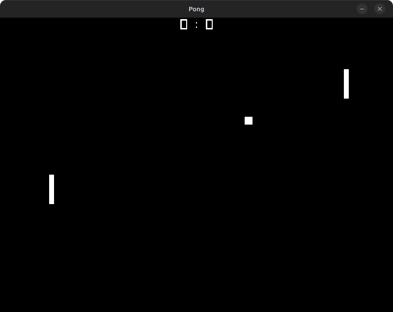

# Pong (raylib)

A simple Pong clone built with [raylib](https://www.raylib.com/).  
Made for learning C++ game development.

---

## 🎮 Features
- Classic 2D Pong gameplay
- Player vs Player (local)
- Score tracking

---

## 🚀 Build & Run
Clone this repo and compile with:

### Create build folder
```bash
cmake -B build -DCMAKE_POLICY_VERSION_MINIMUM=3.5
cmake --build build
```

### Run the game
```bash
./build/pong-raylib/pong-raylib           # (Linux / macOS)
./build/pong-raylib/Debug/pong-raylib.exe # (Windows)
```
---

## 🎯 Controls
- **Player 1 (Left Paddle):** `W` / `S`
- **Player 2 (Right Paddle):** `↑` / `↓`
- **Exit Game:** `Esc`

---

## 📷 Screenshot


---

## 📚 Learning Goals
- Practice with C++ basics
- Game loop structure
- Collision detection
- Input handling
- Drawing with raylib
